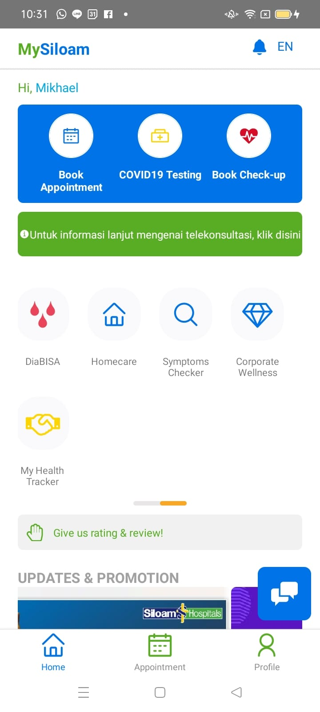
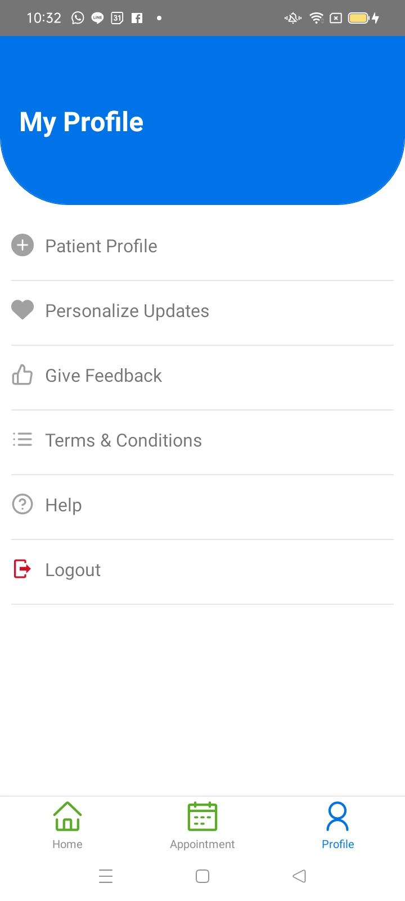
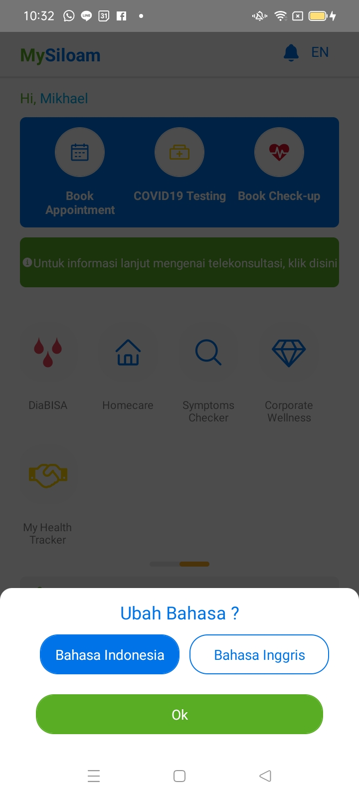

# GoHospital
> Transaction app for joining big startup company.

## Table of Contents
* [Setup](#setup)
* [Usage](#usage)
* [Project Status](#project-status)
* [Room for Improvement](#room-for-improvement)

## Preview

 

## General Information
- A Go Hospitals 3 screen
- Home screen for view all Features and menu
- Appointment screen : it has all upcoming appointment
- Profile Screen 

## Technologies Used
- React - Native 0.68.2
- React Navigation
- Functional Component

## Features
List the ready features here:
- Screen Feature
- Menu Feature

## Setup
Run npm install on react-native project
cd ios && pod install
note : use react-native link (if Needed)

## Usage
npx react-native run-android 
npx react-native run-ios
